相较于易受噪声干扰且灵敏度较低的RSSI，以及肉眼难以直接分辨的相位信息，本报告采用CSI幅值图进行展示。需说明的是，生成更为美观的热力图通常需要借助大量特征工程算法及第三方库的支持，故当前呈现的图示较为基础。尽管如此，仍可清晰观察到：不同动作对应的幅值模式存在显著差异，而同一动作的多次重复则展现出高度相似的波动特征。

| 动作 | 示例幅值波形图1 | 示例赋值波形图2 | 示例幅值波形图3 | 波形特征 |
| :----- | :------: | :-----: | :-----: | :----- |
| 静止 | 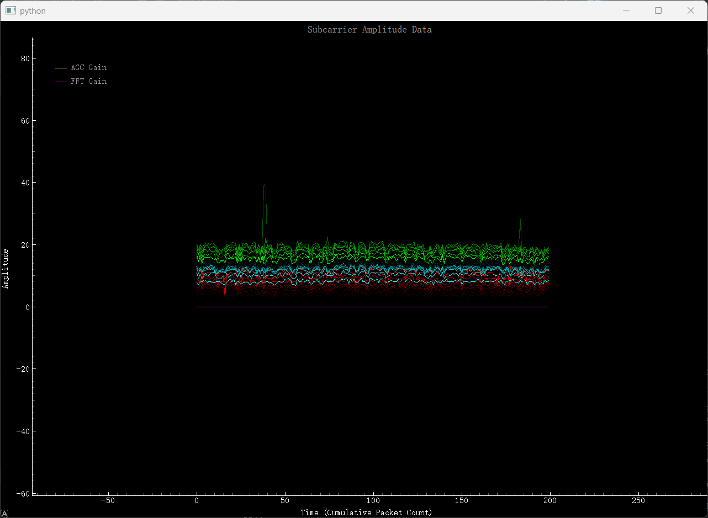 | 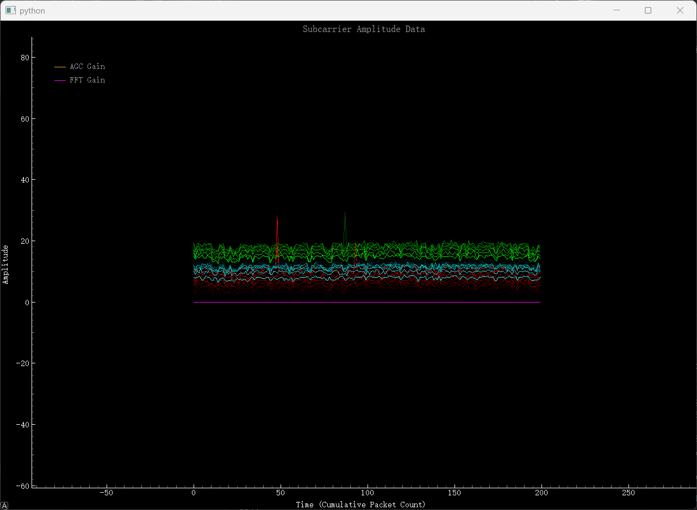 |  | 平稳 |
| 快速挥手 | 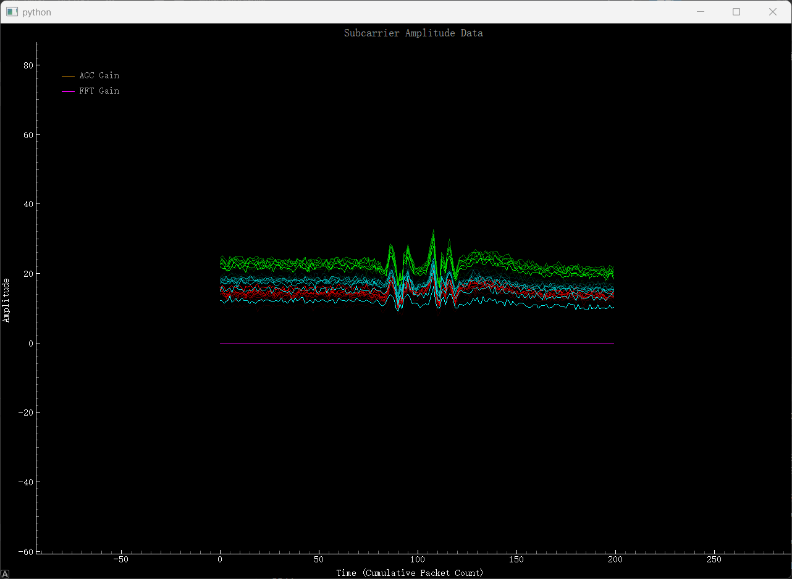 | 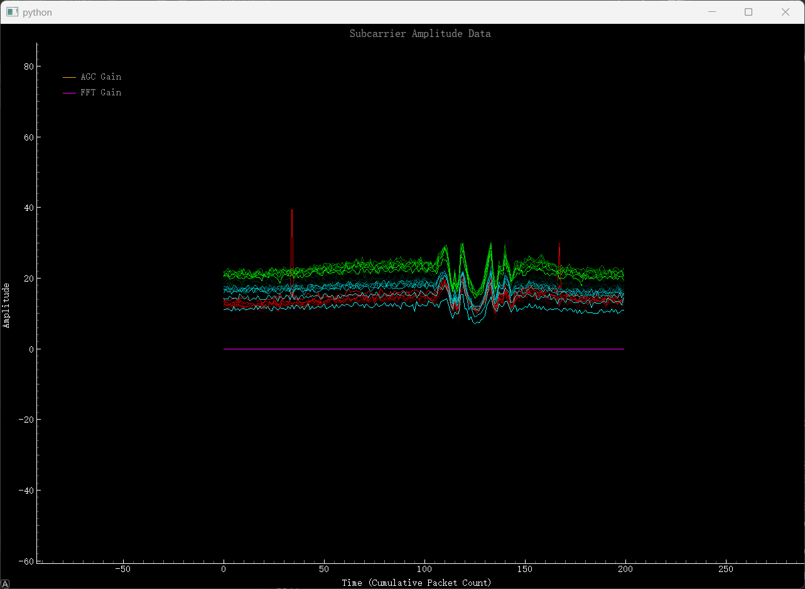 | 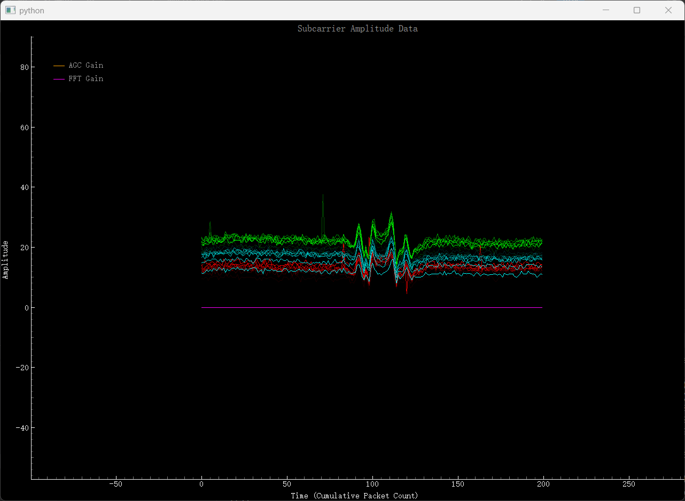 |短时间内及剧烈变化，成n型 |
| 画“8”字 | 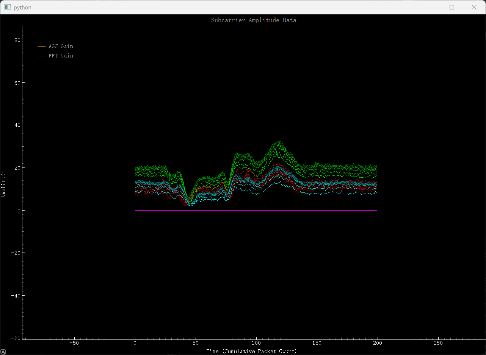 | 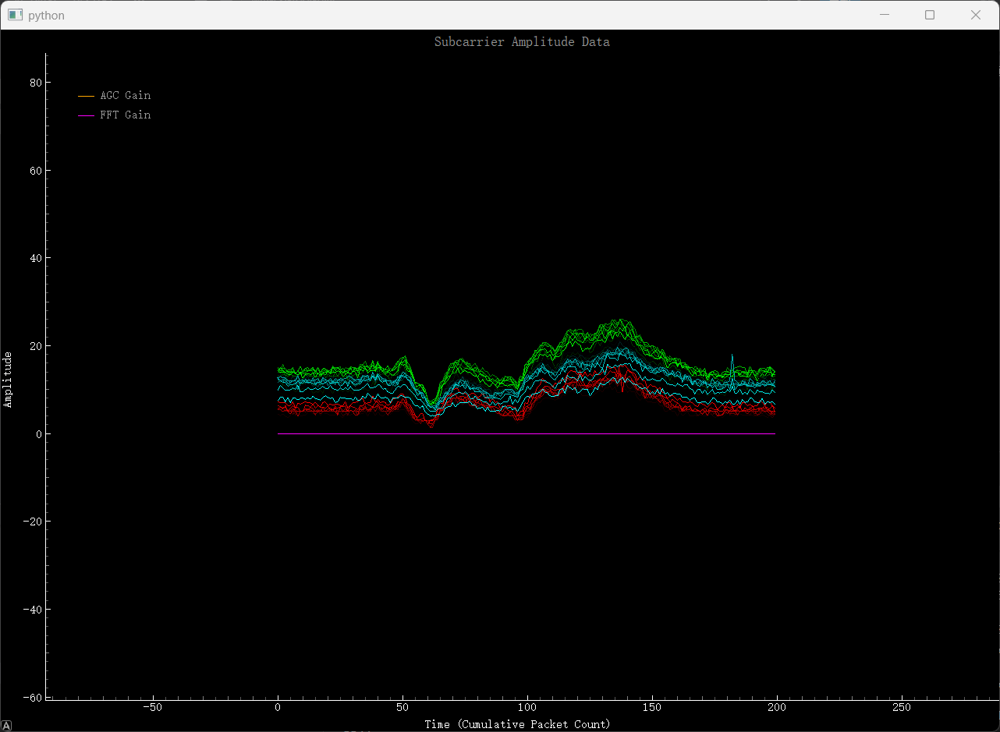 | 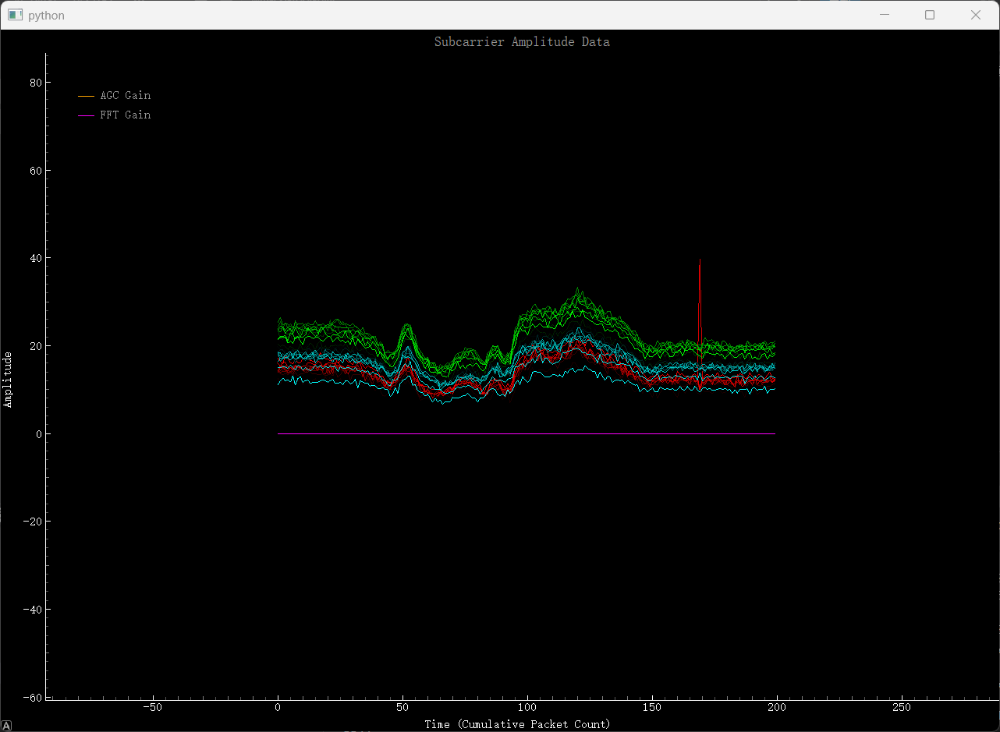 | Z字型，有往复运动特点|
| 画字母“O” | 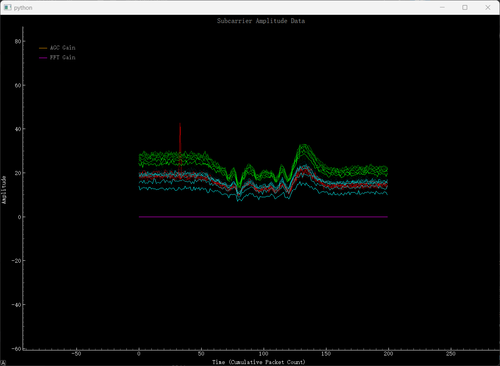 | 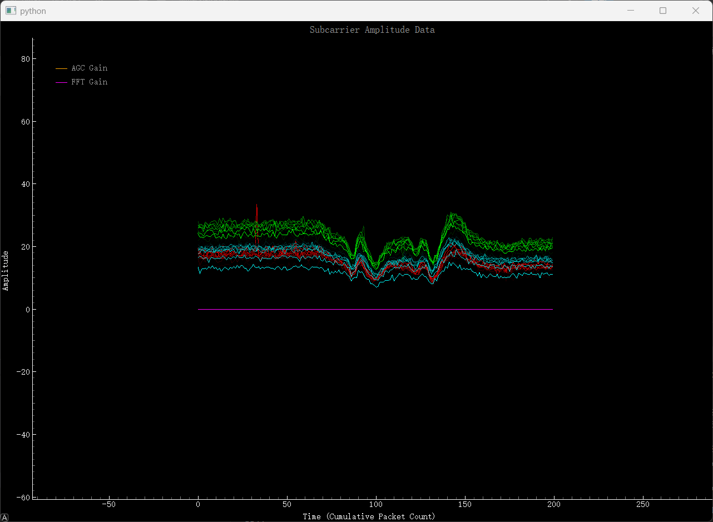 | 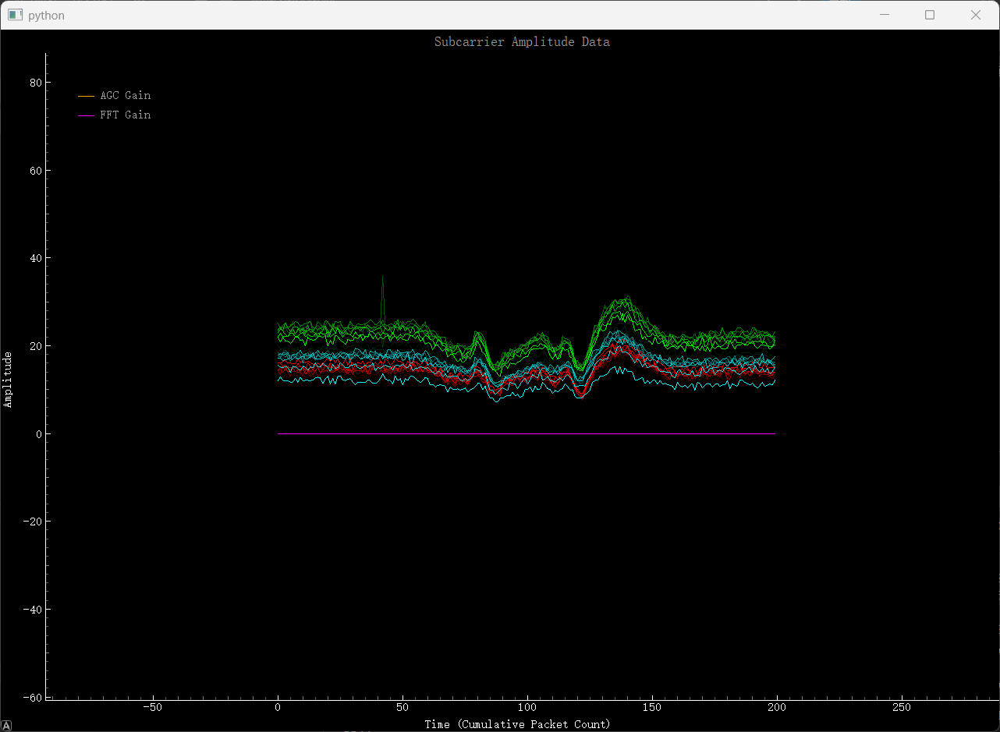 |在接近原点处具有明显可分辨特征 |
| 击掌 | 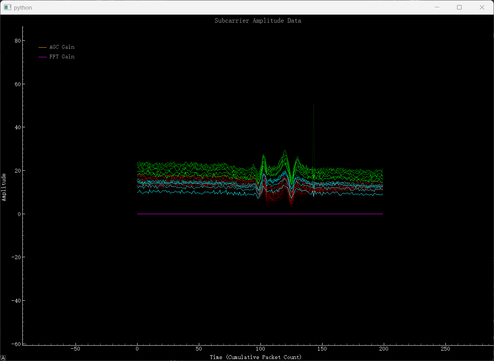 | 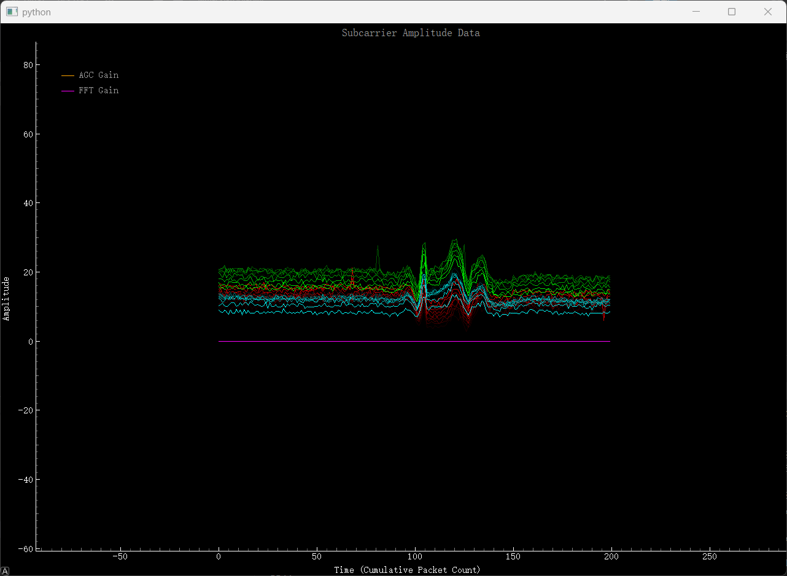 | 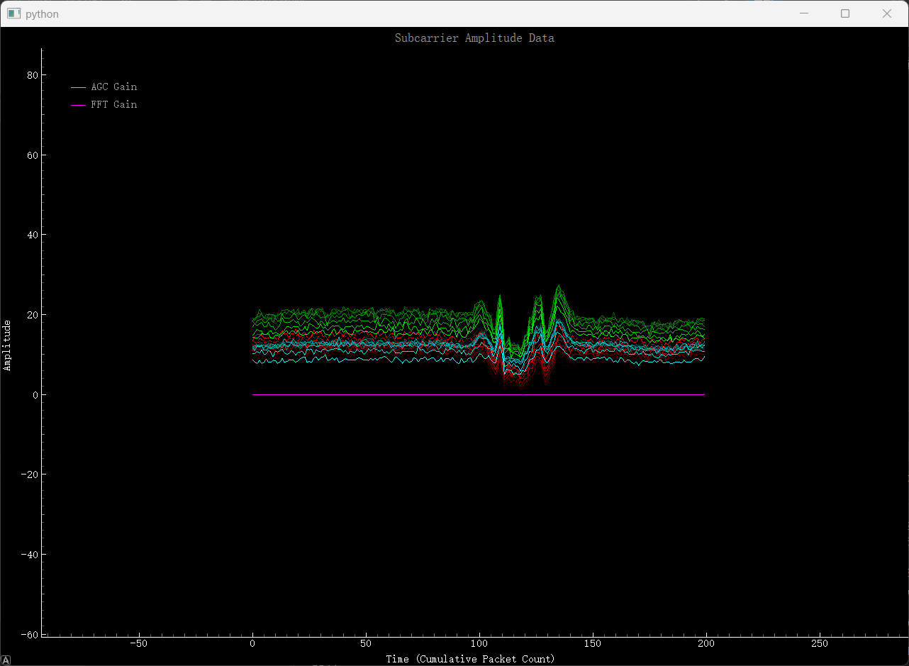 | 呈U形|

虽然肉眼可以较为直接分辨出不同动作，但是对于机器来说，我们需要写一个判别程序来对这种大参数量，范围模糊的数据进行分类，依靠传统的条件分支是难以达到的目的的，所以我们采用了业界主流的识别范式，即**机器识别**。

总的来说，我们需要写出这样一个函数

$$
y = f(x) \in \{\text{静止},\ \text{挥手},\ \text{画8字},\ \text{画O},\ \text{击掌}\}
$$

### 两种实现路径的数学对比

**传统规则方法（if-else）：**

$$
y_{\text{rule}}(x) = 
\begin{cases}
c_1 & \text{if } \phi_1(x) > \theta_1 \land \phi_2(x) < \theta_2 \\
c_2 & \text{else if } \phi_3(x) \in [\theta_3, \theta_4] \\
\vdots
\end{cases}
$$

其中特征 $\phi(\cdot)$ 和阈值 $\theta$ 均需**人工设计**。

**深度学习方法：**

$$
y_{\text{DL}}(x) = \arg\max \left( \text{softmax}\left( W_L \cdot \sigma(\cdots \sigma(W_1 x + b_1) \cdots ) + b_L \right) \right)
$$

其中参数 $\Theta = \{W_1, b_1, \ldots, W_L, b_L\}$ 通过**反向传播自动从数据中学习**，无需人工设定阈值。

> **本质区别**：if-else 的决策边界由人提前写好；深度学习的决策边界由网络自己从数据中"拟合"出来。
