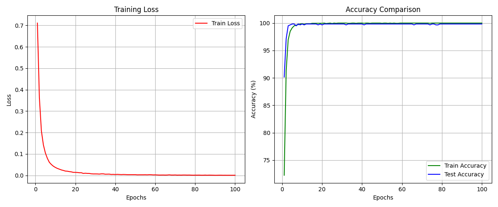
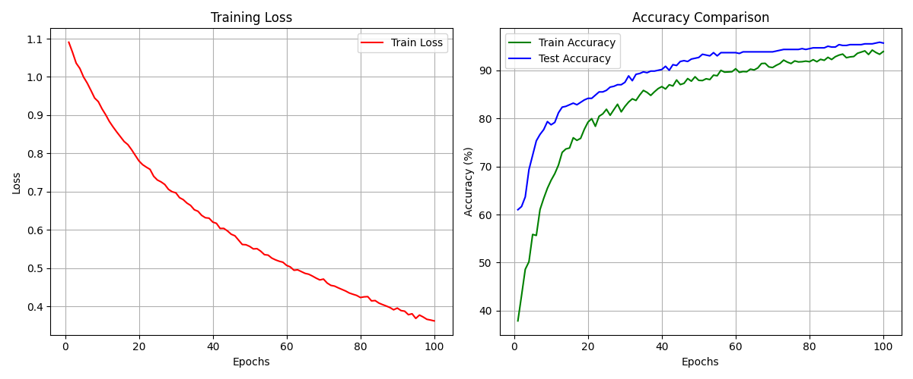
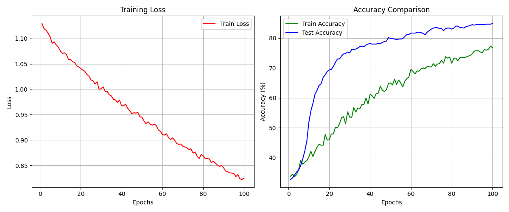
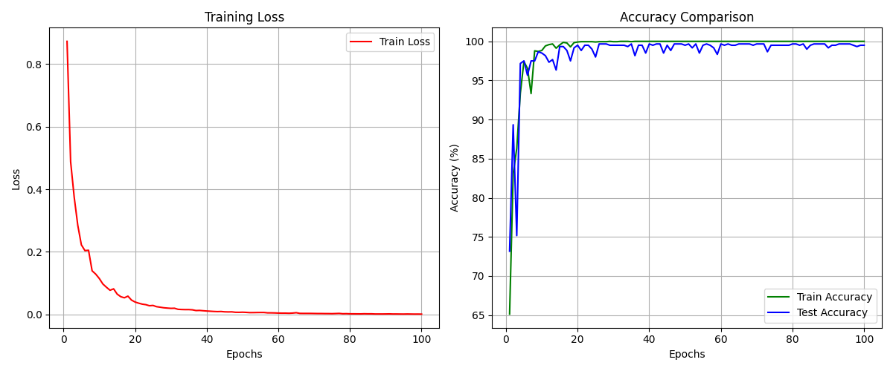
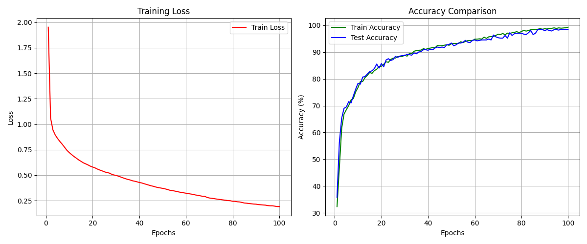
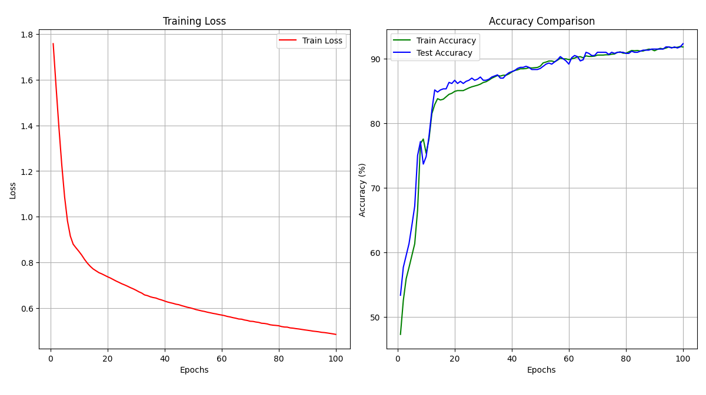

# 📦 数据集获取
- [静态手势数据包含[fist,paper,scissor]](https://baidu.com)

# 📊 实验结果与曲线分析

我们将实验结果按照学习率和批大小的不同组合进行了分组对比。通过下表，您可以直观地比较 CNN 与 MLP 模型在不同参数配置下的收敛表现。

| 模型架构 | LR=1e-5, BS=64   (高学习率) | LR=1e-7, BS=64   (低学习率，小批次) | LR=1e-7, BS=512   (低学习率，大批次) |
| :---: | :--- | :--- | :--- |
| **CNN** |  |  |  |
| **MLP** |  |  |  |

## 🔬 曲线深入分析

**高学习率配置下的表现**
在 LR=1e-5 较高学习率配置下，模型能够较快地捕捉特征，但也更考验架构对权重的更新稳定性。对比表格第一列可以发现，CNN 通常展现出更好的特征提取能力和收敛稳定性，而 MLP 可能在损失下降速度及震荡幅度上有所差异。

**低学习率与批大小的影响**
在 LR=1e-7 的极低学习率下，我们重点观察不同 Batch Size 对训练平滑度的影响。对比表格后两列可知，当改变批大小时（从 64 提升至 512），模型的训练平滑度和梯度下降的稳定性会发生变化。大批次通常能提供更准确的梯度方向，但在极低学习率下可能需要更多的迭代周期才能达到理想的收敛状态。