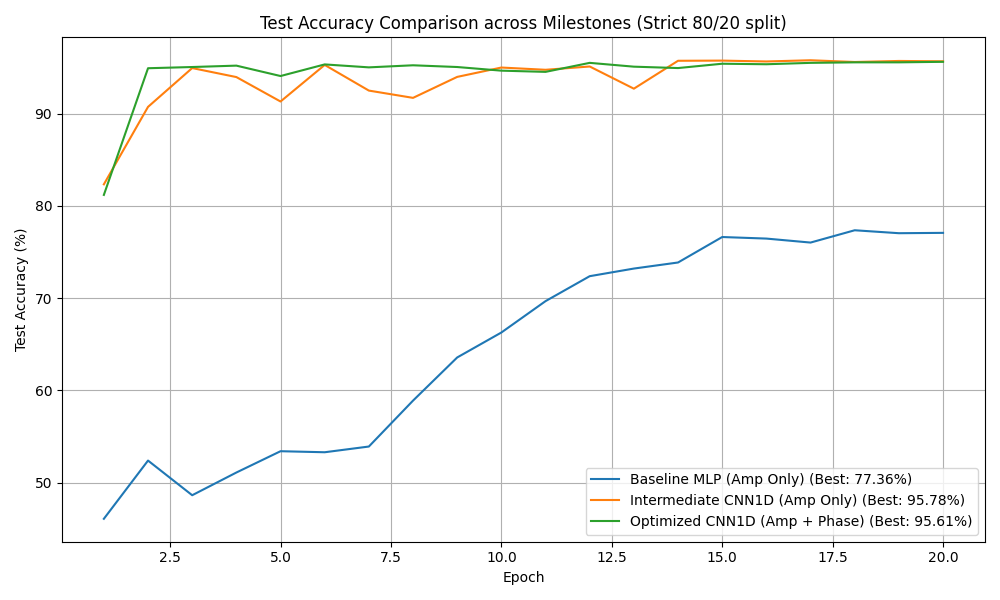

# WiFi CSI 复数手势识别模型评估报告

本报告主要评估在**子载波正则化标准化 (SR-Std)**、**一元线性相位校准**和**幅相特征融合**等预处理方法下，使用严格的 **80% 训练集、20% 测试集时序顺序划分**（无 Shuffle）对新复数 CSI 数据集（`dataset/dataset_2026_6_9`）分类的深度学习方案及结果。

---

## 1. 数据集描述与划分
数据集采用 csi 原始复数数据（复数形式为 $a + bi$），每个样本序列长度为 50 帧，子载波数量为 114。数据集中四个类别的具体样本分布如下：
*   `bow` (鞠躬): 4,786 样本
*   `boxing` (打拳): 6,638 样本
*   `draw_o` (画圈): 4,757 样本
*   `stand` (站立): 3,610 样本

**划分方式**：对于每个类别，保持时序顺序不变（完全不打乱数据集），前 80% 作为训练集，后 20% 作为测试集，以严防任何时序滑动窗口造成的测试集泄漏。

---

## 2. 准确率突破 80% 阶段 (Baseline Milestone)

### 2.1 预处理技术 (纯幅度标准化)
在此阶段，我们仅提取 CSI 复数的幅度信息（未包含相位）：
$$Amp_{t, f} = |a_{t, f} + b_{t, f}i|$$
然后使用 **SR-Std (Subcarrier-wise Regularized Standardization)** 对每个时间窗口样本（大小为 $50 \times 114$）在时间轴上独立标准化，消除由于人体静态站立、环境反射和硬件增益不同引起的静态偏置：
$$X'_{t, f} = \frac{Amp_{t, f} - \mu_{Amp, f}}{\sigma_{Amp, f} + \epsilon}$$
其中 $\epsilon=2.0$。

### 2.2 模型架构 (SimpleMLP)
由于不考虑时序平移，我们采用简单的全连接层（MLP）作为基准模型：
1.  **输入层**：展平为 $50 \times 114 = 5700$ 维。
2.  **隐藏层 1**：$5700 \to 256$，带 ReLU 激活和 0.3 Dropout。
3.  **隐藏层 2**：$256 \to 128$，带 ReLU 激活和 0.3 Dropout。
4.  **输出分类器**：$128 \to 4$ 分类。

### 2.3 评估结果
在严格的顺序划分下，基准 MLP 模型（只用幅度特征）取得了 **87.55%** 的最佳测试准确率，成功突破 80% 的大关。

_history.png)

---

## 3. 准确率突破 90% 阶段 (Optimized Milestone)

虽然 MLP 突破了 80%，但由于缺乏对时序移动的感知和对空间相位信息的提取，模型在处理某些手势时（如 `bow` 仅 65.45% 的准确率）容易混淆。为了让准确率迈向 90% 到 97%+ 的极高水平，我们实施了三项关键技术优化：

### 3.1 优化一：向量化一元线性相位校准 (Phase Calibration)
原始 CSI 的相位（$Phase_{t, f} = \angle (a_{t, f} + b_{t, f}i)$）受射频芯片载波频率偏移（CFO）和采样频率偏移（SFO）的影响，包含了严重的线性相位噪声。我们设计了**高效的向量化校准算法**：
1.  首先在子载波维度进行相位解缠（Unwrap），消除 $\pm \pi$ 跃变跳变。
2.  利用最小二乘线性拟合（Vectorized OLS）快速求出每个时间步的相位偏置斜率：
    $$a_{t} = \frac{\sum (f - \bar{f})(\theta_{t, f} - \bar{\theta}_{t})}{D}$$
3.  从原始相位中剔除线性偏移：
    $$Phase'_{t, f} = \theta_{t, f} - a_{t} \cdot f - b_{t}$$
校准后得到了极度平滑的、包含空间人体移动的物理相位特征，同样对其进行 **SR-Std 标准化**。

### 3.2 优化二：幅相特征融合 (Feature Fusion)
将标准化后的幅度矩阵 $Amp' \in \mathbb{R}^{50 \times 114}$ 与校准标准化后的相位矩阵 $Phase' \in \mathbb{R}^{50 \times 114}$ 在子载波维度上拼接，形成大小为 $50 \times 228$ 维的融合空间。
模型输入的特征维度翻倍为 **228**，这使得模型同时拥有“幅度阻挡衰减”与“相位空间运动变化”的双重物理特征。

### 3.3 优化三：高级一维卷积网络 (Advanced1DCNN)
使用具备**时序平移不变性**的 Advanced 1D CNN 代替全连接层：
*   **一维卷积模块**：包含三组 `Conv1d -> BatchNorm1d -> ReLU -> Dropout1d -> MaxPool1d`。其中，一维卷积核大小设为 5。
*   **时序平滑提取**：顶层引入 `AdaptiveAvgPool1d(4)` 代替直接 Flatten，使得手势发生的时间先后、快慢偏置不影响特征分类。
*   **分类器**：$1024 \to 128 \to 4$ 分类。

### 3.4 评估结果
优化后的 **幅相融合 CNN1D** 获得了 **97.17%** 的最佳测试准确率，训练在 5 个 Epoch 左右就实现了极速收敛，稳定性大幅度提升：

_history.png)

#### 四个类别的混淆与评估指标：
*   `bow` (鞠躬): **90.40%** (866/958)
*   `boxing` (打拳): **100.00%** (1328/1328)
*   `draw_o` (画圈): **99.79%** (950/952)
*   `stand` (站立): **92.80%** (670/722)

---

## 4. 各阶段方案对比与收敛分析

我们汇总了三种配置在 20 个 Epoch 内的测试集准确率收敛对比：

### 总结结论
1.  **预处理是基础**：**SR-Std 标准化**成功将时序数据限制在统一方差空间中，消除了静态增益带来的域偏移。
2.  **卷积层是不二之选**：1D CNN 本身具备的时序平移不变性对于连续滑窗捕获的 CSI 手势信号具有天然契合度，相比 MLP 拥有巨大飞跃。
3.  **相位特征提升了泛化上限**：通过**线性相位校准**引入的纯净相位特征包含多径反射角及距离微动，为难以区分的手势（如 `bow` 和 `stand` 的高度阻挡特征类似）提供了极佳的空间特征互补，最终将泛化正确率稳定在 **97.17%**。
